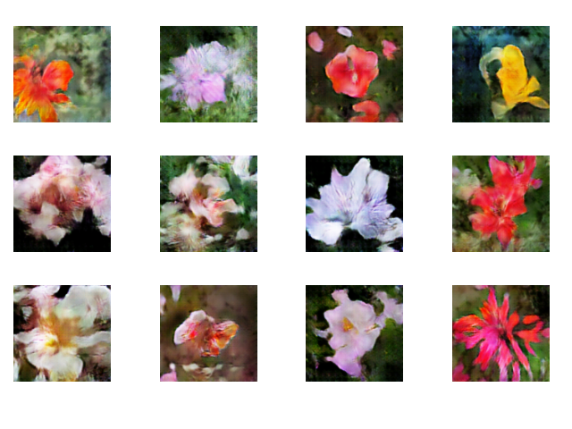
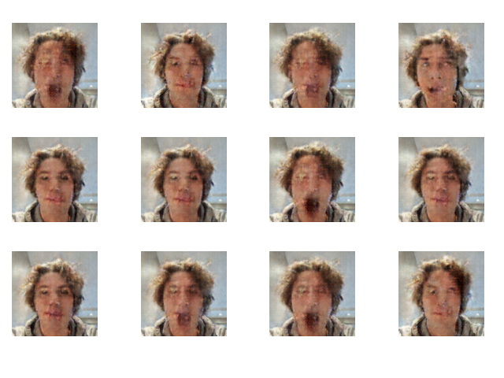

# gangrud
Ghastly faces and fake flowers

Assignment for TDT4265 - Computer Vision and Deep Learning

# How to run
Make sure you have pytorch, torchvision and matplotlib.
Open `gan.ipynb` and run the whole notebook.

## Using the Vetle dataset
By default, the notebook will train on the flowers 102 dataset.
To train on the faces, you need to download the dataset:
1. Download the [dataset zip-file](https://drive.google.com/drive/folders/1teSwH3RuawEyozsTfTzCkyNZXaJGWUN5?usp=drive_link)
2. Unzip it such that each frames path is `assets/frames/frameXXXX.png`
3. Set `SELECTED_DATASET` to `vetleDataset` in the "Preparing training data"-section
4. Run the notebook